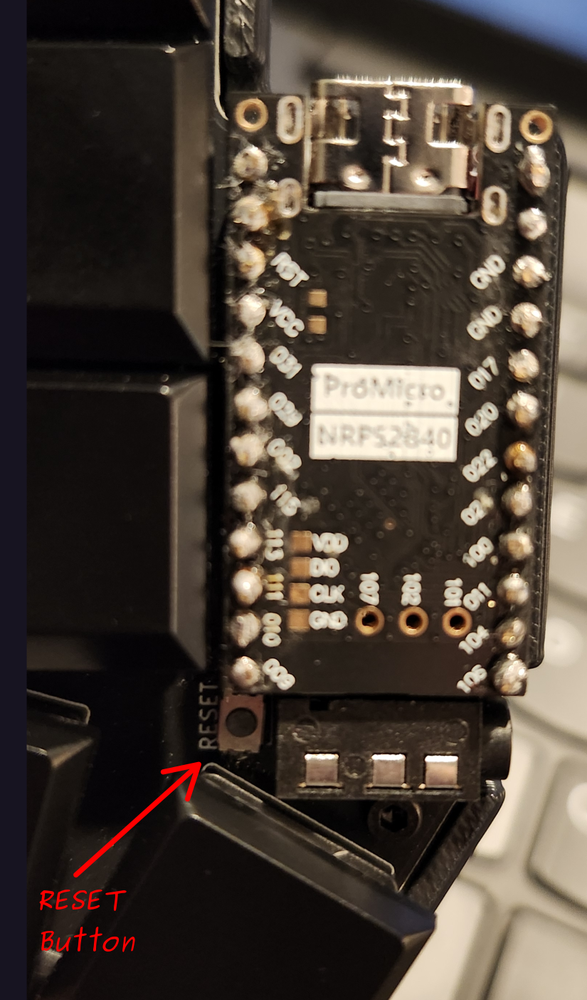

# ZMK Firmware Setup — Ferris Sweep (Cradio)

This documents the ZMK firmware setup for a Ferris Sweep split keyboard using nice!nano v2 controllers.

## Hardware

- **Keyboard:** Ferris Sweep (Cradio)
- **Controller:** nice!nano v2
- **Firmware:** ZMK v0.3

---

## 1. Prerequisites

### Install Git

```bash
git --version
```

If not installed, get it from https://git-scm.com/install/

### Install uv (Python package manager)

```bash
curl -LsSf https://astral.sh/uv/install.sh | sh
```

Close and reopen the terminal, then verify:

```bash
uv --version
```

### Install ZMK CLI

```bash
uv tool install zmk
```

Verify:

```bash
zmk --version
```

---

## 2. Create the zmk-config Repository

Navigate to where you want the config folder to live (e.g., ~/Dropbox), then run:

```bash
cd <path/to/where/you/want/install/local/git/repo>
zmk init
```

Answer the prompts as follows:

- **Create or clone?** → Select **"Create a new ZMK config repo"**
- A browser window will open → log into GitHub if needed → click the green **"Create repository"** button
- Once created, click the green **"<> Code"** button → copy the HTTPS URL → paste it back in the terminal
- **Directory name?** → Press Enter to accept the default `zmk-config`
- **Add a keyboard now?** → Type `y` and press Enter
- **Select a keyboard:** → Type `cradio` to search → select **cradio (Cradio/Sweep)**
- **Select a controller:** → Select **nice_nano_v2**

---

## 3. Edit the Keymap

Open the keymap file:

```bash
zmk code cradio
```

The keymap is located at `config/cradio.keymap`. Edit it to customize your layout.

### Layer Overview

| Layer | How to activate | Contents |
|-------|----------------|----------|
| 0 — Base | Always active | QWERTY, home row mods, tap dance, and thumb layer keys |
| 1 — Navigation | Hold the right inner thumb key (`SPACE`) | Navigation, brackets, arrows, paging, delete/backspace helpers |
| 2 — Number layer | Tap the right outer thumb key to toggle, or access it from Layer 0/2 thumb behavior | Numbers 0-9 |
| 3 — Function layer | Hold the left inner thumb key (`TAB`) | F1-F12 |
| 4 — System/Bluetooth | Activated automatically when Layers 1 and 2 are both active | Bluetooth profile select, clear pairing, reset, bootloader |

---

### Thumb Keys

Each half has two thumb keys sitting side by side at the bottom. Here is what each one does on the base layer:

**Left half thumb keys (left to right):**
- **ESC** — tap to type Escape.
- **TAB / Layer 3** — tap to type Tab. Hold to activate Layer 3 (Function keys).

**Right half thumb keys (left to right):**
- **SPACE / Layer 1** — tap to type Space. Hold to activate Layer 1 (Navigation).
- **Layer 2 toggle** — hold for momentary Layer 2 access, tap to toggle Layer 2 on and off.

Layer 4 is a conditional system layer: it turns on automatically whenever Layers 1 and 2 are both active at the same time.

### Layer Overview

**Layer 0 — Base (always active)**  
Standard QWERTY layout with home row mods. There are also two tap-dance keys:
- **Q** — single tap sends `Q`, double tap sends `Alt+F4`
- **W** — single tap sends `W`, double tap sends `Caps Lock`

**Layer 1 — Navigation**  
Activated by holding the **SPACE** key (right half, left thumb key).  
- Left half top row: `{`, `[`, `Up`, `Page Up`, `(`
- Left half middle row: `Home`, `Left`, `Enter`, `Right`, `End`
- Left half bottom row: `\`, `` ` ``, `Down`, `Page Down`
- Right half top row: `)`, `]`, `-`, `=`, `}`
- Right half middle row: `Ctrl+Backspace`, `Backspace`, `Delete`, `Ctrl+Delete`, `;`

**Layer 2 — Number layer**  
Available through the right outer thumb key.  
- Top row: `1 2 3 4 5` on the left half, `6 7 8 9 0` on the right half
- Other positions are transparent to the base layer

**Layer 3 — Function layer**  
Activated by holding the **TAB** key (left half, right thumb key).  
- Top row: `F1-F5` on the left half, `F6-F10` on the right half
- Middle row edges: `F11` on the far left and `F12` on the far right

**Layer 4 — Bluetooth & System**  
Activated automatically when Layers 1 and 2 are both active.  
- Far left top key and far right top key: **System reset**
- Far left home-row key and far right home-row key: **Bootloader**
- Left half `T` position: Bluetooth profile 0
- Left half `G` position: Bluetooth profile 1
- Left half `B` position: Bluetooth profile 2
- Left half `V` position: **Clear Bluetooth pairing**

### Combos

The keymap also defines a few two-key combos:
- One combo sends **Keypad Num Lock**
- One combo sends **Ctrl+Tab**
- One combo sends **Ctrl+Shift+Tab**

### Home Row Mods

The keys on the middle row (home row) of each half double as modifier keys when held down. A quick tap types the letter; holding activates the modifier.

**Left half middle row (left to right):**
| Physical key | Tap | Hold |
|---|---|---|
| A | A | Left Shift |
| S | S | Left Alt |
| D | D | Left Ctrl |
| F | F | Left GUI (Super) |

**Right half middle row (left to right):**
| Physical key | Tap | Hold |
|---|---|---|
| J | J | Right GUI (Super) |
| K | K | Right Ctrl |
| L | L | Right Alt |
| ' | ' | Right Shift |

---

## 4. Build the Firmware

Commit and push changes to GitHub to trigger a build:

```bash
zmk cd
git add .
git commit -m "your message here"
git push
```

Then open the Actions tab in your GitHub repo, or run:

```bash
zmk download
```

Wait for the build to complete (green checkmark), then download the `firmware.zip` artifact. Extract it — you will find two files:

- `cradio_left-nice_nano_v2-zmk.uf2`
- `cradio_right-nice_nano_v2-zmk.uf2`

### Using GitHub Actions

This repository is set up so GitHub Actions builds the firmware automatically whenever you push changes.

The build matrix is defined in `build.yaml` and currently produces two firmware artifacts:
- `cradio_left` for `nice_nano_v2`
- `cradio_right` for `nice_nano_v2`

To use GitHub Actions step by step:

1. Make your changes in `config/cradio.keymap`, `config/cradio.conf`, or other config files.
2. Commit and push the changes to GitHub.
3. Open your repository on GitHub and click the **Actions** tab.
4. Open the most recent workflow run and wait for both left and right builds to finish.
5. If the run fails, open the failed job and read the log output to see which file or setting caused the error.
6. When the run succeeds, download the build artifact, which is usually named `firmware`.
7. Unzip it and use the resulting `.uf2` files to flash the keyboard halves.

If you prefer the CLI, `zmk download` will download the artifact from the latest successful run for this repo.

---

## 5. Flash the Firmware

### Enter Bootloader Mode

1. Plug the keyboard half into your computer via USB
2. Turn it on
3. **Double-tap the RESET button** on the PCB — it is labeled "RESET" on the board itself. Double-tapping means pressing it twice quickly, like a double-click.
4. A drive called **NICENANO** will appear on your computer



### Flash Each Half

1. Drag and drop `cradio_left-nice_nano_v2-zmk.uf2` onto the NICENANO drive
2. The drive will disappear automatically — flashing is complete
3. Repeat for the right half using `cradio_right-nice_nano_v2-zmk.uf2`

> **Note:** For subsequent flashes, only the left (central) half needs to be reflashed if you are only updating the keymap.

---

## 6. Pairing the Keyboard Halves

The two halves pair automatically over Bluetooth when both are turned on. No manual pairing is needed.

---

## 7. Connecting via Bluetooth

1. Make sure both halves are turned on
2. Open Bluetooth settings on your computer
3. The keyboard will appear as **cradio**
4. Click to connect

### Clearing Bluetooth Pairing

If you need to clear the pairing (e.g. to connect to a new device):

1. Activate Layer 4 by turning on Layers 1 and 2 at the same time
2. Press the **V** key (BT_CLR) on the left half
3. Scan for the keyboard again on your device
